# 18家全球最佳托管WordPress主机(高性能与安全)

面对全球访问速度、安全防护与运维人力的三重压力，托管WordPress主机是更省心的选择。
从Cloudflare加速、CDN覆盖，到一键迁移与自动备份，这些平台把复杂性隐藏起来，让你以更低部署门槛获得更稳定、更快的站点表现。
本榜单聚焦高性能、可扩展与易用性，帮助你在预算可控的前提下上线或迁移关键业务站点。

## [Rocket.net](<https://rocket.net>)
企业级边缘加速WP主机平台

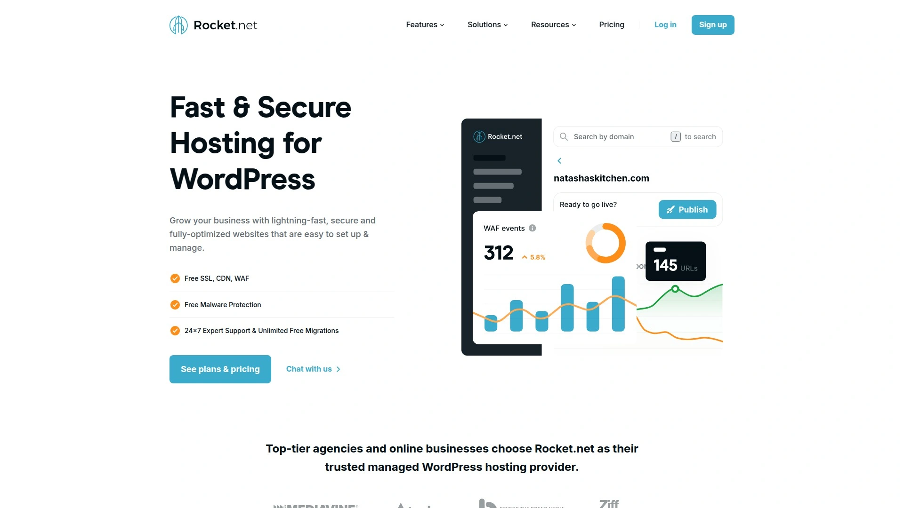

- 核心亮点：内置Cloudflare Enterprise，全球边缘缓存+WAF+DDoS；全站HTTP/3、Brotli，静动皆可提速。
- 一键上手：后台开站、SSL、暂存环境与每日备份默认开启；提供迁移协助，几分钟上线。
- 适用场景：跨境/多地区访问、WooCommerce、电商大促与内容突发峰值。
- 成本与管理：按站点计费，CDN与安全防护随附，减少外部插件与额外服务开销。
- 推荐理由：低部署门槛、稳定低TTFB与广覆盖，兼顾高性能与可控成本。

## [Kinsta](<https://kinsta.com>)
面向增长的云端WP托管平台

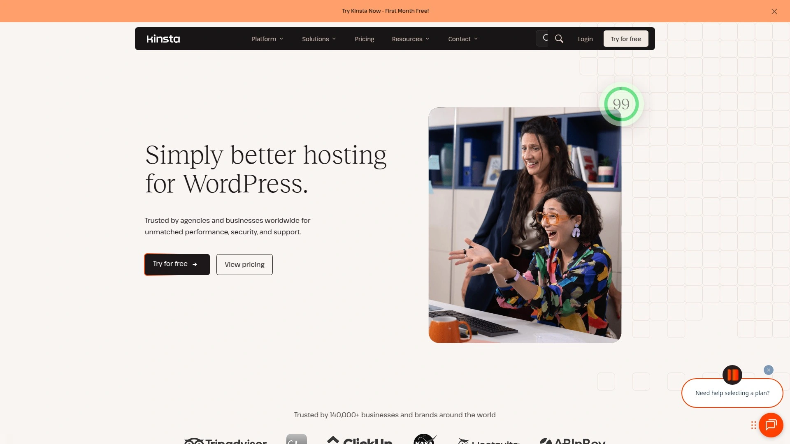

- 依托Google Cloud高性能计算，结合Cloudflare边缘缓存与安全。
- MyKinsta面板直观，内置APM、资源分析、自动备份与暂存；适合持续迭代的产品团队。
- WooCommerce与会员站点支持友好，多数据中心可选以贴近用户。
- 费用按站点/访问量梯度；文档完善、支持响应快。

## [WP Engine](<https://wpengine.com>)
企业与机构级WP托管平台

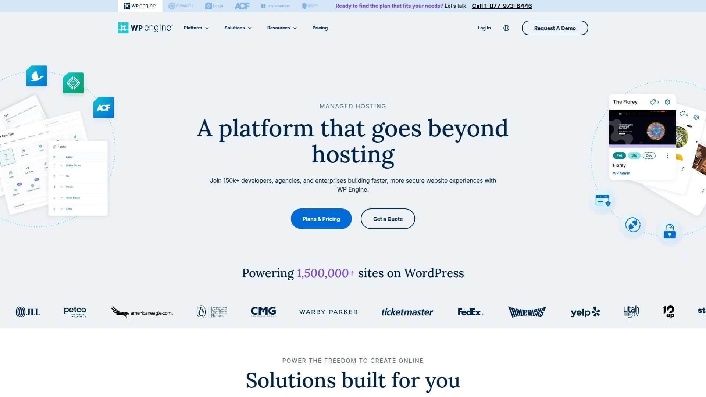

- Dev/Stage/Prod多环境、Git集成与自动化部署，CI/CD实践落地。
- EverCache与内置CDN强化动态站性能，安全团队负责核心与插件更新。
- 适合品牌官网、活动页与营销栈集成；专业支持与顾问服务健全。
- 定位偏企业级，节省自管基础设施的人力成本。

## [Cloudways](<https://www.cloudways.com>)
多云弹性托管与WP优化平台

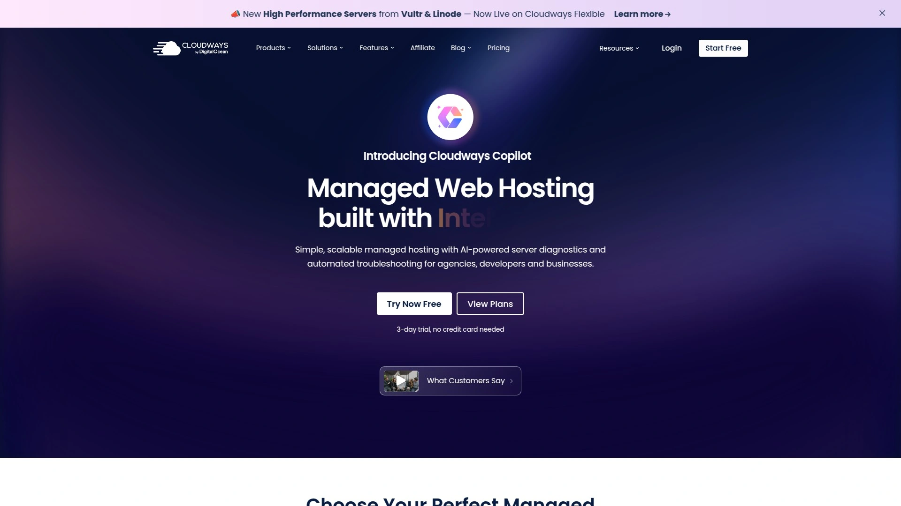

- 可选DigitalOcean/AWS/Google Cloud等底层，弹性伸缩，灵活度高。
- Nginx+Varnish+Redis缓存堆栈，一键暂存与团队协作完善。
- 适合技术型团队与代理商，平衡可控成本与性能。
- 按资源计费，多项目集中管理便于规模化。

## [Pressable](<https://pressable.com>)
官方生态加持的WP主机平台

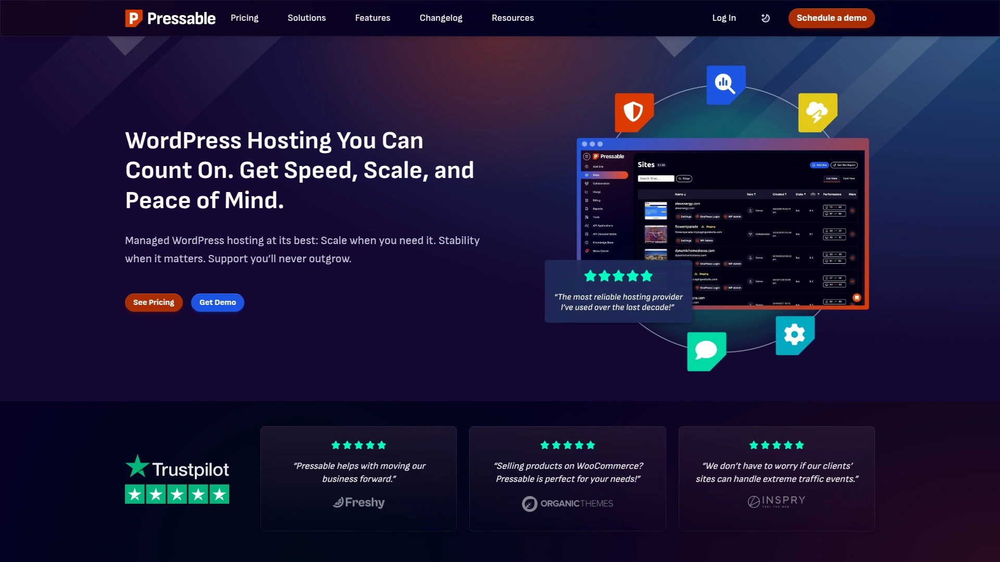

- 植根WordPress生态，集成Jetpack安全与性能工具。
- 备份、暂存、SSL与恶意拦截开箱即用；对WooCommerce友好。
- 稳定运维与长期内容/电商站适配佳。
- 方案透明，核心安全与CDN能力内置，减少第三方依赖。

## [Nexcess](<https://www.nexcess.net>)
电商友好的高扩展WP托管

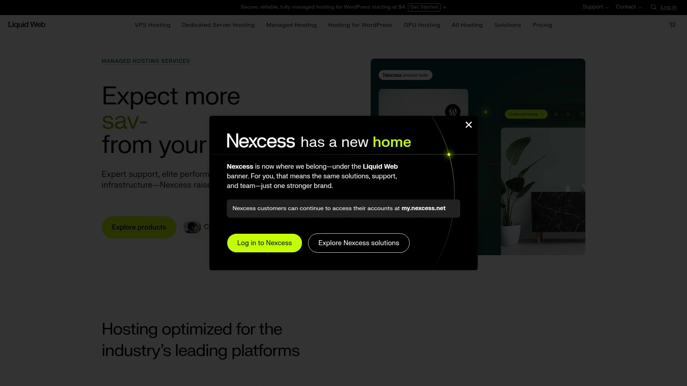

- 针对WooCommerce深度优化：图像压缩、性能监控与自动扩容策略。
- 每日备份、暂存、插件更新管控与预警，降低线上风险。
- 面向促销峰值与SKU较多的商店；欧美访问表现稳健。
- 电商套餐功能更完整，按档位分层。

## [Pantheon](<https://pantheon.io>)
团队协作友好的WebOps平台

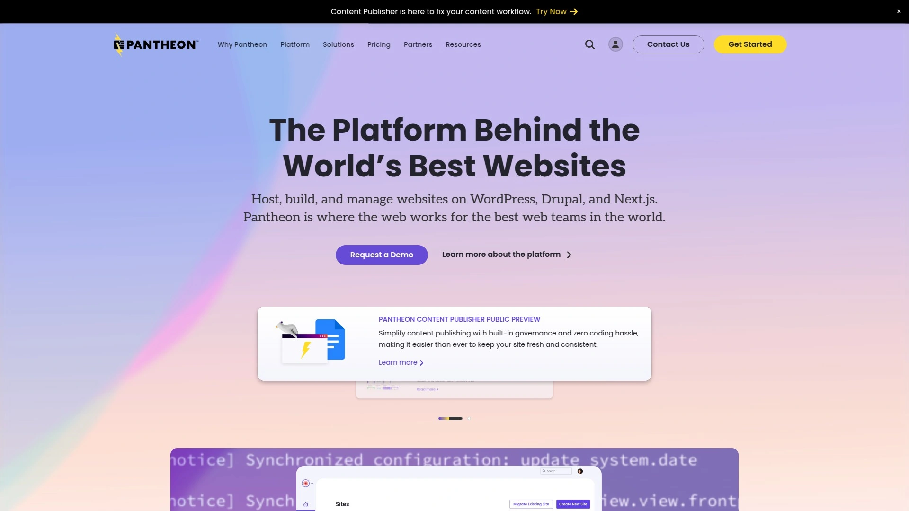

- 强调WebOps流程：多分支、多环境、合并与回滚清晰可控。
- 适合多站点与内容团队协同，保障发布节奏与质量。
- 内置CDN与安全防护，提升全球访问与稳定性。
- 面向开发团队与机构，学习曲线略高但换来规模化治理。

## [Flywheel](<https://getflywheel.com>)
为代理商设计的WP托管平台

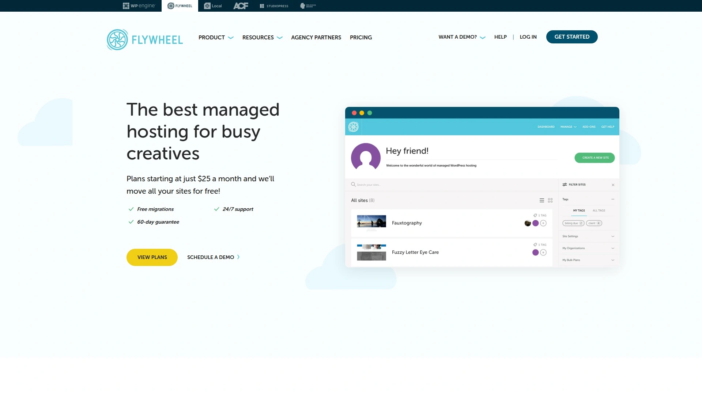

- 客户账单转移、批量管理与权限协作，适合代理/自由职业者。
- 集成本地开发工具Local，开发-上线流转顺畅。
- 每日备份、SSL、缓存与全球CDN覆盖主流需求。
- 按站点分档，成本核算清晰。

## [SiteGround](<https://www.siteground.com>)
稳定易用的入门级WP托管

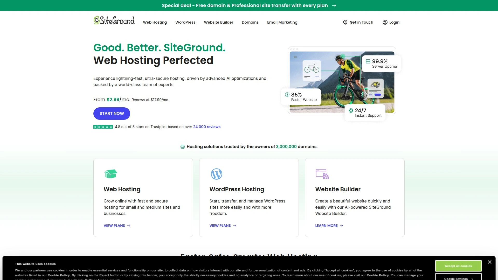

- 基于Google Cloud，SG Optimizer一键缓存与图像优化。
- 自动备份与安全加固默认开启，新手容易上手。
- 适合博客、企业名片站与区域业务站点。
- 套餐灵活，附带邮箱与CDN选项，性价比较高。

## [Liquid Web](<https://www.liquidweb.com>)
高可用与支持著称的主机平台

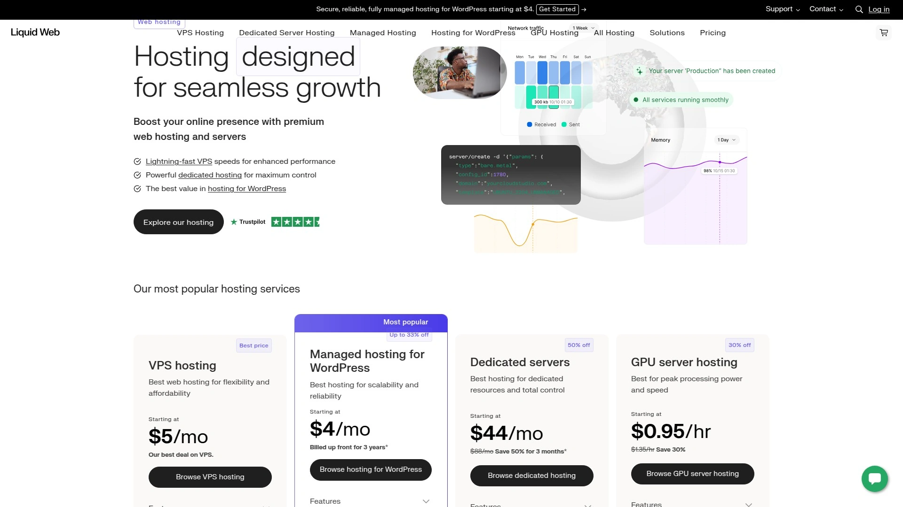

- 面向关键业务，提供高性能VPS/独服与专业支持团队。
- 适合自定义栈、合规或高安全要求的应用与大型WP集群。
- 可选备份/监控/扩展方案，技术响应专业。
- 成本高于共享型，但稳定性与掌控力显著提升。

## [Bluehost](<https://www.bluehost.com>)
新手友好的WordPress主机

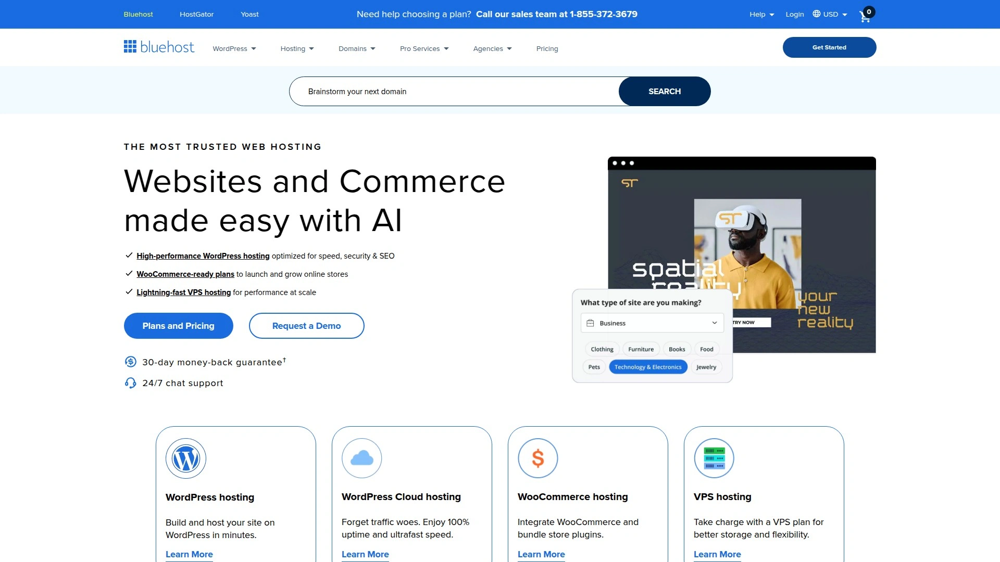

- 域名、SSL、自动安装与可视化面板集合，建站门槛低。
- 一键主题/插件安装，适合个人与小型商家快速上线。
- 提供CDN与安全选项，覆盖主流入门需求。
- 定价亲和，便于从入门到成长的阶段性升级。

## [DreamHost](<https://www.dreamhost.com>)
性价比均衡的WP托管方案

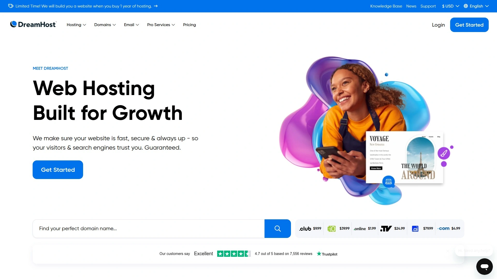

- WordPress官方推荐商之一，面板清爽、自动备份与更新。
- SSD存储，支持暂存与内置缓存，按需扩容。
- 适合内容型网站与轻量电商，成本可控。
- 支持按月/按年，预算友好。

## [Hostinger](<https://www.hostinger.com>)
全球节点覆盖的WP主机平台

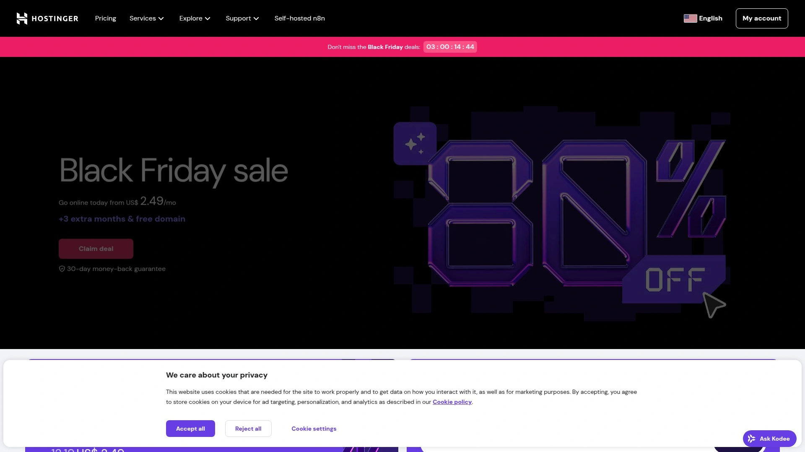

- 采用LiteSpeed+LSCache，静态/动态加速兼顾。
- hPanel易上手，多数据中心可选；对多语言与跨区站点友好。
- 一键迁移与自动备份，维护简单。
- 定价灵活，整体费用友好。

## [A2 Hosting](<https://www.a2hosting.com>)
注重性能优化的WP主机平台

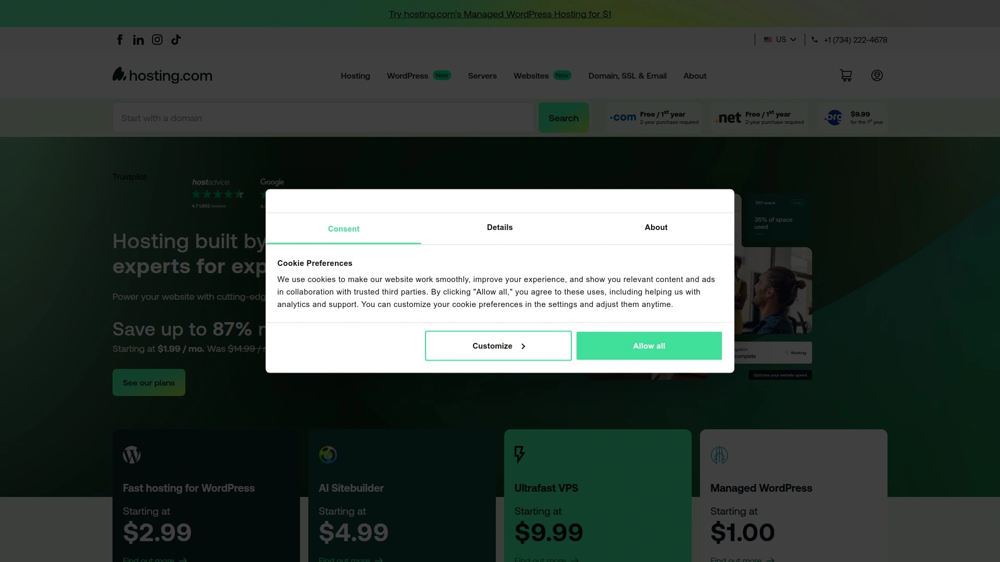

- Turbo/NVMe与LiteSpeed栈，注重IO与并发处理。
- SSH、Git、Staging等开发者功能完善。
- 适合技术倾向用户与需要更高性能的中小站点。
- 套餐覆盖共享至独服，多场景可选。

## [Pressidium](<https://pressidium.com>)
企业级高可靠的WP托管平台

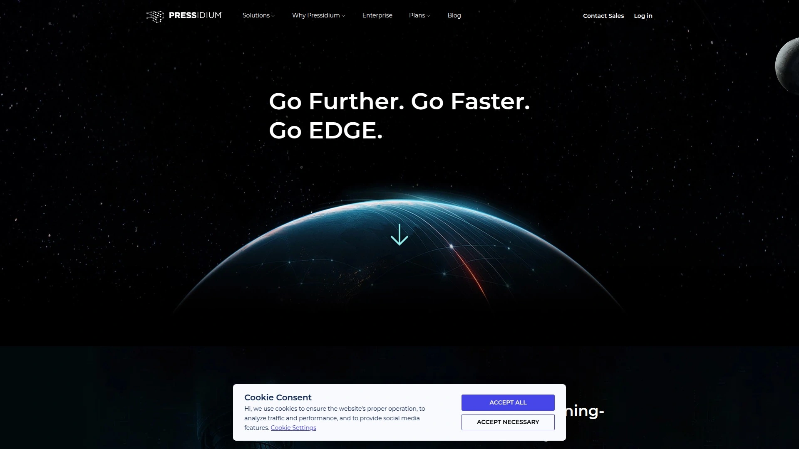

- 多层缓存、自动故障转移与细粒度发布流程，强调可用性。
- 安全扫描、WAF与备份策略完善，适合高价值内容站。
- 全球PoP与优化路由，跨区域性能稳定。
- 定位中高端，重视SLA与长期可用性。

## [InMotion Hosting](<https://www.inmotionhosting.com>)
商务级支持与稳健性能的WP主机

- NVMe存储与资源隔离，保证稳定运行。
- 自动备份与安全套件齐全，后台简洁易用。
- 美国节点表现突出，客服响应稳定。
- 分层定价，便于按阶段扩容。

## [GreenGeeks](<https://www.greengeeks.com>)
强调环保与性能的WP主机

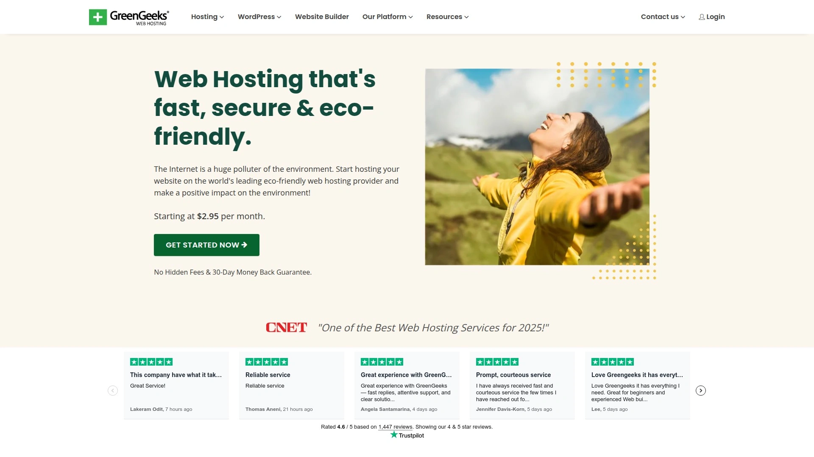

- 以绿色能源抵消为特色，同时提供LiteSpeed与CDN。
- 安全加固、每日备份与一键迁移，运维负担小。
- 适合注重可持续与合规表达的品牌网站。
- 成本亲民，功能对个人与中小站足够。

## [10Web](<https://10web.io>)
AI建站与WP托管一体化

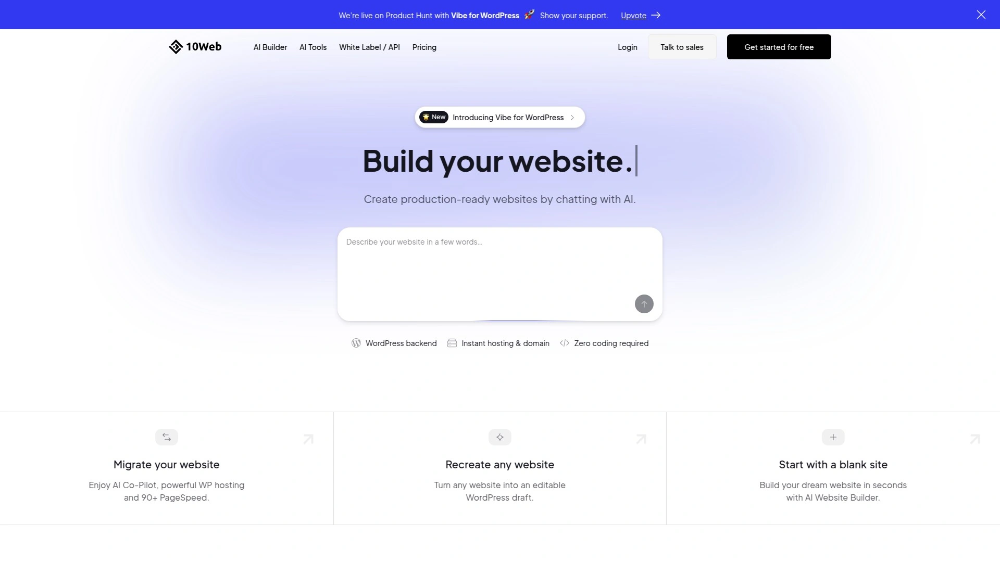

- 基于Google Cloud，集成PageSpeed优化与自动化运维。
- AI网站生成与拖拽编辑，快速搭建上线。
- 适合小团队快速试错与营销着陆页。
- 按站点/资源分层，升级路径顺滑。

### 常见问题(FAQ)

- 如何快速上手并迁移现有站点？
  选定平台后创建暂存环境，使用官方迁移工具或人工协助完成导入；低峰时切换DNS，逐点核验TTFB/LCP与表单、结账流程。

- 跨境访问或多地区用户，优先看什么？
  优先选择带Cloudflare Enterprise或等效CDN与边缘缓存、内置WAF的平台；测试关键地区的TTFB与缓存命中率，必要时启用对象缓存/数据库优化。

- 托管效果如何评估是否达标？
  连续一周观察TTFB、LCP、95/99分位响应、错误率与可用性；电商站重点测结账路径耗时与高峰稳定性，必要时扩容或调整缓存策略。

### 结语与选择建议

以上18款覆盖从入门到企业级的托管WordPress主机，目标是一件事：以更低运维成本获得更稳定、更快、更可控的全球访问。
为什么第1名的[Rocket.net](<https://rocket.net>)适合跨区域高并发电商与内容站：默认企业级边缘加速与安全防护，能在全球范围持续压低TTFB并提升稳定性。
建议先做小规模迁移或试运行，验证关键指标后再扩容到正式方案。
